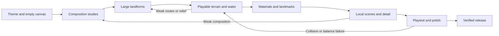

# Creating original BFME2 maps: from rough composition to finished landscape

The map develops like a painting: establish its composition, build large forms,
resolve secondary forms, then add selective detail and finish. At every stage it
should read as a coherent landscape at that stage's level of detail.

This is the authoring workflow for future original bfmeXbar maps. It is a design
and production method, not a claim that a new map has already been built. The
[worked example](map-workflow-example.md) applies it to a fresh LOTR-inspired theme.

The first actual from-scratch implementation is now [The Ashen March](ashen-march.md).
Its [technical log](ashen-march-format-findings.md) records the new-document constructor,
native validation and remaining editor/playtest limitations. Use that measured path
where the capability table below still describes the earlier toolset.

## The starting point

Start with a **new, empty, uniformly elevated plane**. Choose a theme, playing
experience and intended scale before drawing the terrain. Do not load, enlarge,
flatten or strip the objects from a stock map and call that a new composition.
The terrain, river network, routes, starts and landmarks must originate in this
map's design. BFME2's existing textures and object assets remain usable materials.

Prefer WorldBuilder's new-document operation to create the native file container.
Its engine defaults are document infrastructure, not an inherited landscape.
Record the initial empty state before adding starts, water, scenery or gameplay
objects. Add required starts and player settings in a separate functional pass.

**Current capability:** `tools.worldbuilder.blank` constructs a new native document
without loading a donor map. Empty, functional and sculpted Ashen March checkpoints
have passed native BFME2 loading/rendering checks. WorldBuilder open/save remains
unverified because its control helper could not initialize. Keep that editor gate
explicitly unverified; do not substitute a stock map or describe native rendering
as an editor round trip.

## The painting principle

| Painting concept | Map-authoring equivalent | Review question |
|---|---|---|
| Canvas and intention | Empty native map and a one-page brief | What experience should this place create? |
| Thumbnail composition | Several small plans of masses, voids, routes and a focal point | Is the whole map interesting before any props exist? |
| Block-in | Broad elevation masses and open lowlands | Can the landscape be understood in three or four shapes? |
| Form and depth | Ridges, saddles, valleys, terraces and drainage | Do the landforms have convincing volume and relationships? |
| Underpainting | A restrained texture/material palette | Do surfaces explain the land instead of disguising weak geometry? |
| Focal detail | Landmark construction and designed local scenes | Where should the player's eye and armies go? |
| Supporting detail | Ecological clusters, edges, paths and wear | Does detail reinforce the place and leave useful negative space? |
| Finishing | Blends, grounding, visual cleanup and playtest corrections | Are the remaining rough edges distracting or obstructive? |

Use three scales deliberately: **whole-map composition**, **regional scenes** and
**ground-level detail**. Finish the decisions at the larger scale before increasing
detail at the smaller scale. Revisit the larger scale whenever a local edit changes
the silhouette, drainage or route network.



## Pass 0 — Establish intention

Write a brief with a place, mood and physical story. Specify the number of players,
mode, desired battle scale and the decisions the terrain should offer. Distinguish
a skirmish battlefield from a scripted battle with timed reinforcements; they need
different starts, economy, scripts and verification.

Choose one dominant landmark and two or three supporting regions. Describe why
each exists: an old road follows a saddle, a settlement occupies a defensible
terrace, woodland collects on sheltered slopes. Identify what should remain open.
Record a restrained material palette and a few things that would break the theme.

Choose playable dimensions separately from the stored border. For this toolset,
one tile spans 10 world units. Express requested size as total area or axis lengths;
three times each axis is nine times the area. The earlier 840 x 953 map's short
native test is evidence for that document, not a general WorldBuilder size limit.

**Produce:** one-page brief, intended dimensions, three gameplay goals, three
visual goals, assumptions and a measurement plan for travel time and performance.
**Advance when:** the goals can be tested, and the theme makes concrete design
choices possible. Do not ask for approval at every pass unless the user wants that.

## Pass 1 — Create and prove the empty canvas

Create a new native document at the intended dimensions, with one base material
and a uniform height that leaves room for lower ground and water. Save an immutable
`00-empty` checkpoint. Inspect it: height minimum equals maximum, no inherited
scenery, roads, rivers, named locations or custom scripts. Record unavoidable editor
defaults separately. Keep an editor screenshot, parser report and file hash.

Make a separate `01-functional` checkpoint containing only the starts, ownership,
player settings and metadata necessary for a match. Open/save it in WorldBuilder
and load it in native BFME2. Check the actual dimensions, both starts, basic orders,
camera coverage and return from the far strategic view. Verify map registration;
a file that opens into a shell scene is not a successful skirmish startup.

**Produce:** empty and functional checkpoints, provenance, editor evidence and a
native baseline. **Advance when:** the canvas is demonstrably new and the intended
size works. Solve format/startup failures before sculpting or decorating.

## Pass 2 — Make composition studies

Draw at least three quick alternatives over the blank rectangle. Use broad masses,
not individual trees: high ground, low ground, woodland, open ground, water and
landmark. Add starts and route arrows. These are planning diagrams, not screenshots
or finished terrain. Compare them at thumbnail size and in a simple height sketch.

Choose a plan for its route choices, focal hierarchy and distribution of open space.
Avoid equally spaced features everywhere, a lone central choke, mirrored scenery
without purpose, and a landmark whose only role is to fill an empty spot. Symmetry
can help fairness, but equivalent opportunities need not look identical.

Draw three sections through the chosen layout: across the main fight, along a
reinforcement route and across the principal ridge. Mark relative heights, saddle
positions, valley widths and skyline. Plan room for camera views at ground and
strategic scales, including the map edge.

**Produce:** alternatives, chosen plan, rejected-option reasons, sections and a
named route graph. **Advance when:** the map has a clear identity without textures
or props and offers more than one meaningful approach to the main fight.

## Pass 3 — Block in the large forms

Sculpt a few broad terrain masses from the plane: mountain shoulders, a ridge
system, a basin, a main valley and its terraces. Use temporary simple materials.
Reserve the base areas and broad deployment spaces. No decorative scatter yet.

Work in grayscale/height views and in low, oblique native views. A high peak at the
edge does not make a mostly flat interior detailed. Review the sections from Pass 2
and measure height distribution and regional slopes as well as maximum height.
Conversely, do not turn every useful battle plain into rough ground.

Blend protected base clearings into the surrounding land over long, irregular
shoulders. A radial flat mask with a short falloff can make an artificial circular
cliff bowl. Avoid covering weak shapes with rock textures. Horizontal enlargement
without new vertical design makes existing slopes gentler; do not use enlargement
as a substitute for sculpting an original map.

**Produce:** coarse heightfield, slope/height diagnostics, revised sections and
angled views of at least three regions. **Advance when:** the primary forms read
clearly, useful lowlands remain, and elevation contributes to the intended play.

## Pass 4 — Resolve secondary forms, water and traversable routes

Add saddles, spurs, gullies, river terraces and local shoulders that belong to the
large forms. Build secondary forms at a smaller scale; reserve tiny noise for late
surface variation. Random bumps are not a substitute for connected terrain.

For procedural assistance, retain the designed masses and warp their coordinates
with independent low-frequency noise fields. Add rotated fBm octaves for secondary
relief and restrained ridged noise for smaller folds. Apply thermal erosion to
relax oversteep slopes, then regrade routes and bases. Use a fixed seed and inspect
before/after height sections; noise amplitude must not erase the composition.
The original operators in `tools.worldbuilder.earth` implement this sequence's
building blocks. They do not simulate rivers or hydraulic sediment transport.
See the [algorithm research and measured example](ashen-march-format-findings.md#open-algorithm-research).

Place drainage through the low ground, then set water levels, banks and crossings.
Review the entire stream profile. Changes in water height require a deliberately
authored transition; do not produce an accidental uphill river or unsupported
water plane. Water geometry and terrain heights are separate native data.

Design roads around gradients and destinations. Define each critical route's
purpose, narrowest width, climb and fallback route. Measure widths against actual
horde formations and large units. Do not adopt a universal numerical slope or
width threshold without testing those units in this game.

Use a terrain-grid reachability check as an early rejection filter. It does not
model horde width, turning, object collision, water rules or combat congestion.
Test native movement in both directions through every required crossing and
saddle, including several battalions arriving together. An artificial height cutoff
can falsely reject shallow fords; use the actual map's movement semantics.

**Produce:** route table, water-level notes, updated height/slope views, test clips
and failures. **Advance when:** primary and fallback routes work in game and the
landscape remains coherent. Return to Pass 3 if the large forms make this impossible.

## Pass 5 — Establish gameplay and landmark footprints

Test starts, expansion space, economy locations, neutral objectives and the places
where armies assemble. Compare travel time and approach exposure from each side.
Fairness includes usable building space, retreat opportunities and access to routes,
not merely equal straight-line distances.

Block landmarks with a few representative native objects. Fit the site into the
terrain using a terrace, foundations, retaining slopes or rubble. Check collision
before committing a dense composition. Keep both fighting space and reinforcing
space visible in the plan. For scripted scenarios, explicitly define destinations,
timing, ownership and failure behavior; do not inherit the Grey Mountains preset.

**Produce:** timed route observations, footprint plan, landmark blockouts and the
scenario/economy specification. **Advance when:** a sparse match is already worth
playing and the landmark silhouettes help orient the player.

## Pass 6 — Lay in materials and atmosphere

Choose a small working palette. Paint large material zones first, following slope,
moisture, geology and use: exposed rock, grassy shoulders, damp low ground, worn
road and settlement paving. Keep light/dark and warm/cool relationships readable
at strategic distance. Add secondary materials only where they explain a transition.

Do not cover open ground with noise-threshold material islands to conceal texture
tiling. Even similar colors can read as camouflage when their edge density is too
high. Establish a continuous base soil, then paint wear or exposed rock where the
scene calls for it. Judge this at overview distance before adding another palette
entry. The Ashen March revision-2 rejection is the worked counterexample.

Blend boundaries at close range. Avoid repeating checkerboards, hard stamps, long
unbroken rock bands and texture scale changes across adjacent tiles. Inspect cliff
mapping and water banks separately. Our `paint` recipe applies a hard-edged base
coat and clears existing blends; it is not the finished blending pass.

Choose lighting and atmosphere to support the theme while leaving slopes and units
legible. Verify fog and water reflections in native views, including the far zoom.
Do not grade the image or add props merely to hide malformed terrain.

Record the native graphics preset with the review. The reference smoke profile's
Low preset hides props and disables volume/shadow-map shadows, so it can conceal
authored detail and invalidate a lighting judgement. The current launcher defaults
to Medium; High's shadow-map path failed the large-map timing test. Confirm cast
shadows in actual screenshots and keep performance evidence with any preset change.

**Produce:** palette list, representative material transitions and day/lighting
settings. **Advance when:** the landscape reads well without dense scenery.

## Pass 7 — Compose local scenes

Finish the main landmark first, then supporting scenes. Give each a short physical
story: how a wall fell, how a path reaches an entrance, why rubble collected there,
which side of a ruin became overgrown. Align structures to their site and vary
damage deliberately. Randomly rotated walls do not make a believable settlement.

Treat forests as shapes with cores, edges, clearings and approach views. Vary density
by slope, shelter and ground type. Place rocks as outcrops and related fragments;
use undergrowth at transitions rather than uniformly across the map. Revisit the
whole-map thumbnail so local detail does not compete with the focal landmark.

**Produce:** one near-finished representative region, then the other named regions.
**Advance when:** the first region demonstrates the intended quality and cost.
Do not repeat an unsuccessful style across the entire map before reviewing it.

## Pass 8 — Add selective fine detail

Add small rubble, roots, grasses, path wear, broken edges and shoreline accents.
Concentrate effort where players look, fight, move or recognize a place. Use quieter
supporting areas to keep those scenes readable. Detail is a hierarchy of meaningful
relationships, not an object-count target.

Automate approved placement rules with fixed seeds, slope limits and explicit
exclusions. Inspect results rather than accepting a scatter pass because it filled
its quota. Check foundations, terrain-relative Z offsets, clipping, repeated
silhouettes, debris scale, entrances, building plots and horde collision. Re-run
the critical route tests after scenery is present.

**Produce:** regional close-ups, placement recipe/seed records and updated collision
tests. **Advance when:** detail improves the design without consuming necessary
army space or the measured performance budget.

## Pass 9 — Playtest, critique and polish

Run from every supported start. Test ordinary recruitment and a representative
large army, opposing traffic, retreat, reinforcement arrival and combat at each
choke. Test cavalry, infantry hordes, large monsters and siege where supported.
For a scenario, verify every wave actually reaches its intended fight.

Compare sparse and detailed performance on the same machine, resolution, camera
locations, army composition and repeated test route. Record frame times or another
consistent measured metric, not an impression or unrelated DLL counter. Observe
both idle terrain and active combat. Set an explicit target in the brief rather
than inventing a universal engine capacity.

Review at three distances: tactical, transition and strategic. Check symbol
readability, selected-unit visibility, camera clipping, map edges and water. Capture
genuinely different regions; record actual camera focus, orientation, height and
map hash. A file named `forest.png` is not proof that the camera reached a forest.

Keep a critique list ordered by impact: broken routes or starts; weak terrain or
composition; collision or performance; local visual polish. Repair the earliest
relevant pass, then rerun affected later gates. Finish material seams, floating
objects, exposed borders, accidental repetition and misleading minimap imagery.

**Produce:** corrected candidate, test matrix, comparative screenshots and remaining
limitations. **Advance when:** no required gate is failed or untested. Missing
evidence means unverified, not passed.

## Pass 10 — Package the finished map

Save the final candidate in WorldBuilder, checkpoint it, inspect the resulting
chunk diff and reload those exact saved bytes in BFME2. Regenerate previews from
the final geometry; do not copy a stock map's image into a new map's release.
Package the map and its sidecars consistently, register it locally and test the
actual launch entry point. Record hashes, revision, build steps and known limits.

Only now capture the final high-resolution portrait. Retain unedited native
screenshots as evidence alongside presentation exports. A tiled image combines
different moments, so it cannot prove simultaneous battle state or performance.
Keep proprietary assets in the local ignored runtime; commit authoring code,
briefs, recipes and documentation to the local repository.

## The agent's iteration loop

Use one map writer at a time. Save and close the editor document before external
edits. Reload it before the next editor pass; an unsaved editor copy can overwrite
newer geometry. Drive editor controls only through an available, observed UI
workflow; do not turn recorded screen coordinates into blind macros.

For each iteration, write a small record:

```text
Pass / revision:
Question being resolved:
Input checkpoint and SHA256:
Change and reason:
Expected visual and gameplay effect:
Actual evidence: editor view, src/native views, route test, measurements
Decision: keep / revise / discard
Failed or unverified gates:
Next smallest useful change:
```

Change one class of concern at a time: topology, elevation, materials, landmarks,
vegetation or presentation. Inspect after a bounded batch. Keep the previous
checkpoint until the new one passes its gate. To compare alternatives, branch a
checkpoint into a new workspace; do not accumulate experimental edits blindly.
Use a fixed seed while tuning placement rules so comparisons remain meaningful.

Suggested storage:

```text
projects/maps/<map-id>/                    brief, layout decisions, recipes, release notes
runtime/worldbuilder/<map-id>/    working src/native file, checkpoints, transactions
artifacts/<map-id>/               editor/native evidence and diagnostic reports
```

## What the current tools actually support

| Step | Current support | Required boundary |
|---|---|---|
| Brand-new native document | `tools.worldbuilder.blank`; native-tested by Ashen March | Preserve the empty checkpoint; editor open/save is still unverified |
| Native inspection and chunk diffs | `tools.worldbuilder.cli` and `analyze` | Lossless parsing does not prove engine semantics |
| Checkpoints and seeded bulk edits | `checkout`, `apply`, `checkpoint`, `diff` | An existing file is required; for this workflow that must be the new blank document |
| Raising and flattening terrain | Recipe operations | Broad brushes are tools, not a finished terrain design |
| Base texture painting | Recipe operation; blank constructor writes palette and cardinal blends | Full corner/three-way WorldBuilder blending is not implemented |
| Asset placement | Prototype recipes or explicit records through `blank.add_object` | Validate template names against native Object/ChildObject/ObjectReskin declarations and inspect real model footprints |
| New water, roads, starts and scripts | No general authoring recipe API here | Author through the editor; do not reuse the Ithilien resize path as a blank-map builder |
| Registration and scenarios | Current helpers contain map-specific values | Parameterize/test for the new map; `ithilien.cache_entry` and `--battle` are not generic |
| Native launch | `launch.py --map` accepts a short virtual map path | Install/register the candidate in the isolated mod first |
| Automated gallery and 8K capture | `--map-check` and `--map-photo` accept `--map-tour` JSON | Configure focus, shots, output and map hash; standalone `map_gallery.py` still targets Ithilien |
| WorldBuilder UI automation | Adapter exists; previous connection failed | Inspect current tool availability and actual editor state before claiming a UI pass |

After creating the **new blank document**, these are supported commands, run from
the repository root. Substitute paths and the hash from `status`; angle brackets
are placeholders, not literal PowerShell syntax.

```powershell
.\.venv\Scripts\python.exe -m tools.worldbuilder.cli inspect '<new-empty.map>'
.\.venv\Scripts\python.exe -m tools.worldbuilder.cli checkout '<new-empty.map>' original-map
.\.venv\Scripts\python.exe -m tools.worldbuilder.cli status original-map
.\.venv\Scripts\python.exe -m tools.worldbuilder.cli apply original-map '<pass-recipe.json>' --expect-sha <file_sha256>
.\.venv\Scripts\python.exe -m tools.worldbuilder.cli handoff original-map
.\.venv\Scripts\python.exe -m tools.worldbuilder.cli checkpoint original-map --note 'Describe the actual evidence'
.\.venv\Scripts\python.exe -m tools.worldbuilder.cli diff '<before.map>' '<after.map>'
```

The CLI's `status` deliberately leaves editor/game verification false. Keep the
evidence separately; do not relabel a checkpoint note as a verified editor save.
The source-specific `ithilien` and `relief` generators are useful lessons and code
references, but are not this workflow's starting document or original terrain.

Implementation details: [authoring commands](../src/tools/worldbuilder/README.md),
[native file structure](map-format.md), and
[existing map's measured limits](../projects/maps/ithilien-frontier/README.md).
