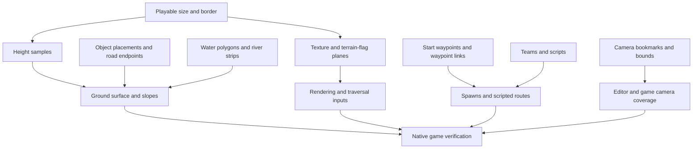

# BFME2 world-file analysis

Analyzed 8 October 2026: Grey Mountains, Ithilien and Osgiliath from this project's
native BFME2 mod tree. This is a read-only analysis; no map or running game was
changed. The machine-readable reports are in `artifacts/worldbuilder-analysis/`.

The file is a collection of versioned binary sections, not a single terrain image.
It contains placements and references to the game's existing assets. The familiar
BFME2 models, animations, movement and combat still come from the original engine
and object definitions. Our prepared armies and reinforcement orders are currently
created by `native/host/battle.inc`, not embedded in Grey Mountains.

## Measured contents

| Property | Grey Mountains | Ithilien | Osgiliath |
|---|---:|---:|---:|
| Decompressed bytes | 7,263,414 | 3,130,059 | 3,376,046 |
| Top-level sections | 20 | 20 | 20 |
| String-table entries | 80 | 97 | 105 |
| Terrain samples, including border | 585 x 650 | 360 x 410 | 380 x 420 |
| Border width | 50 | 30 | 30 |
| Playable dimensions, tiles | 485 x 550 | 300 x 350 | 320 x 360 |
| Placed object records | 1,344 | 1,743 | 1,188 |
| Distinct placed templates | 63 | 105 | 140 |
| Terrain texture entries | 65 | 51 | 75 |
| Texture blend records | 14,724 | 12,405 | 18,299 |
| Cliff texture mappings | 0 | 140 | 0 |
| Actual player-start waypoints | 4 | 2 | 4 |
| Standing-water polygons | 1 | 1 | 1 |
| River strips | 0 | 12 | 1 |
| Named camera bookmarks | 1 | 1 | 8 |

All three files decode and serialize to exactly the same decompressed bytes. This
checks container preservation; it does not prove every field's engine semantics.

For Grey Mountains, I also compared the local map to its original `Maps.big` entry.
The original is 1,159,079 compressed bytes. Its decompressed contents have the same
length as our local map. Only bytes 7,021,678 and 7,021,679 differ, both inside the
four-byte `cameraMaxHeight` float: original 300, bfmeXbar 7,200. This identifies the
current example as the stock terrain with our camera modification.

## Outer file structure

```text
Optional EAR\0 wrapper
  uint32 little-endian decompressed length
  EA RefPack compressed stream
    decompressed CkMp document

CkMp document
  4 bytes: "CkMp"
  uint32: number of names
  name table, indexes descending from N to 1
    variable-length integer: UTF-8 byte length
    UTF-8 name bytes
    uint32: name index
  repeated chunks until end of document
    uint32: name index
    uint16: version
    uint32: payload byte count
    payload bytes
```

Numeric values described below are little-endian. Chunk lengths exclude their
10-byte headers. Some payloads contain nested chunks; others contain counts and
records. A generic recursive chunk parser cannot safely treat every payload alike.
The string table is shared by chunk names and property keys. Preserve its existing
IDs when retaining opaque sections; changing IDs without updating all references
corrupts the document.

## Grey Mountains section directory

Offsets refer to the decompressed document. The name table ends at byte 1,523.

| Section | Version | Header offset | Payload bytes | Contents |
|---|---:|---:|---:|---|
| HeightMapData | 5 | 1,523 | 760,552 | Dimensions, borders, elevations |
| BlendTileData | 18 | 762,085 | 6,259,565 | Texture indexes, blends, terrain flags |
| WorldInfo | 1 | 7,021,660 | 96 | Camera and map settings |
| MPPositionList | 0 | 7,021,766 | 168 | Multiplayer-slot configuration |
| SidesList | 6 | 7,021,944 | 1,215 | Player/faction properties |
| LibraryMapLists | 1 | 7,023,169 | 243 | Library-map references per list |
| Teams | 1 | 7,023,422 | 657 | Team ownership and configuration |
| PlayerScriptsList | 1 | 7,024,089 | 140 | Fourteen empty script lists |
| BuildLists | 1 | 7,024,239 | 116 | Fourteen empty faction build lists |
| ObjectsList | 3 | 7,024,365 | 237,318 | Placed templates and waypoint objects |
| TriggerAreas | 1 | 7,261,693 | 4 | Zero trigger polygons |
| StandingWaterAreas | 2 | 7,261,707 | 107 | One water polygon |
| RiverAreas | 2 | 7,261,824 | 4 | Zero river strips |
| StandingWaveAreas | 2 | 7,261,838 | 4 | Zero shore-wave areas |
| GlobalLighting | 8 | 7,261,852 | 1,360 | Lighting payload |
| PostEffectsChunk | 1 | 7,263,222 | 45 | Post-processing payload |
| EnvironmentData | 3 | 7,263,277 | 41 | Environment payload |
| NamedCameras | 2 | 7,263,328 | 48 | One camera bookmark |
| CameraAnimationList | 3 | 7,263,386 | 4 | Zero camera animations |
| WaypointsList | 1 | 7,263,400 | 4 | Zero waypoint links |

Terrain and texture/pathing storage account for about 96.7% of the decompressed
Grey Mountains document. Objects are much smaller because their meshes and textures
are referenced rather than copied into every placement.

## Terrain and texture data

`HeightMapData` v5 starts with four uint32 values: width, height, border width,
border-record count. Each border record holds two uint32 values. A further uint32
stores the sample count, which must equal width times height. The rest is a
row-major array of uint16 elevations: Y outside, X inside.

For BFME2, the elevation conversion is `storedHeight * 0.0390625`. A horizontal
tile is 10 world units. The authoring coordinate conversion is:

```text
sampleX = worldX / 10 + borderWidth
sampleY = worldY / 10 + borderWidth
```

Grey Mountains has 380,250 samples, with measured heights from 0 to 270.4296875.
Its border records are `(485,550), (0,0), (0,0), (0,0)`. The zero records should be
preserved rather than interpreted as four equally active regions.

`BlendTileData` v18 is more than a texture layer. After its uint32 sample count:

| Plane | Stored representation |
|---|---|
| Primary texture tile | uint16 per sample |
| Blend index | uint32 per sample |
| Three-way blend index | uint32 per sample |
| Cliff mapping index | uint32 per sample |
| Impassability | Packed bits |
| Impassability to players | Packed bits |
| Passage widths | Packed bits |
| Taintability | Packed bits |
| Extra passability | Packed bits |
| Flammability | One byte per sample |
| Visibility | Packed bits |

Each bit plane is padded **at the end of every row**. Its byte size is
`ceil(width / 8) * height`, not `ceil(width * height / 8)`. On Grey Mountains these
are 48,100 and 47,532 respectively. Using the latter would misalign every later
field. The visibility plane is map authoring data; do not assume it replaces the
runtime shroud/fog system.

The tail holds texture descriptors, blend descriptors and cliff UV mappings.
Texture descriptors name existing game textures and describe their cell layout.
Blend descriptors are 18 bytes each in these files; cliff mappings are 38 bytes.
The analyzer consumes this entire tail exactly for all three maps. Several blend
flags remain semantically uncertain and are retained raw.

Changing the heightmap dimensions therefore requires rebuilding **all eleven
matching planes** and their counts, while keeping palette references valid.
Textures should retain their tile scale when expanding a battlefield.

## Placed objects, players and paths

Each nested `Object` v3 record contains:

```text
float32 x, y, z
float32 orientation in radians
uint32 flags, including road/bridge endpoint flags
uint16 byte length + template name
property dictionary
```

Property dictionaries start with a uint16 count. Each property has a one-byte
type, a three-byte name-table index, then a typed value: bool, int32, float32,
length-prefixed narrow string or UTF-16 string. Typical properties include
`uniqueID`, `originalOwner`, `objectLayer`, initial health and enabled state.
Template names resolve through game data; they are not embedded 3D models.

The same object list also contains `*Waypoints/Waypoint` records. Their properties
carry `waypointID` and `waypointName`, including `Player_1_Start` and similar names.
`WaypointsList` contains **links between waypoint IDs**, not the waypoint positions.
Its being empty does not mean the map lacks start locations.

Grey Mountains' starts, in world XY coordinates:

| Start | X | Y |
|---|---:|---:|
| Player 1 | 3,645.17 | 4,506.90 |
| Player 2 | 1,169.96 | 916.39 |
| Player 3 | 1,185.17 | 4,500.97 |
| Player 4 | 3,627.59 | 917.84 |

Its eight multiplayer-position records, fourteen player records and fifteen team
records serve different purposes. They do not make it an eight- or fourteen-player
map. The player records include neutral/civilian/creep roles and faction templates.

Road records are another important exception to scenery placement. Ithilien has
34 start endpoints and 34 end endpoints in `ObjectsList`. Osgiliath also uses
angled endpoints. Scaling ordinary objects but leaving those endpoints unchanged
would detach roads from their surroundings.

## Water, scripts and cameras

Standing water is a polygon with a water level and material references. A river is
an ordered list of cross-sections, each storing two XY endpoints, plus its level,
flow/UV settings, textures, tint and opacity. Shore waves are a separate section.
Transform water geometry with the terrain's XY transform, while deciding vertical
levels separately. A named ford is not proof of traversability: native terrain and
pathfinding still need testing.

Ithilien contains twelve river strips, including `ford1` through `ford4`, and 140
cliff UV mappings. These make it a useful visual reference, but more complicated to
resize than Grey Mountains. Osgiliath contributes a richer ruin palette and has two
top-level scripts, `Set Science` and `Towers Fall`. Their names and boundaries were
decoded; their action/condition operands were not interpreted in this pass.

Named cameras contain a look-at XYZ, name, pitch, roll, yaw, zoom, field of view and
an unresolved float. Animated camera tracks are separate. Bookmarks can lie outside
the playable bounds: Osgiliath's `Textures` bookmark does. Do not clamp every
coordinate merely because it is outside the playable rectangle; border scenery,
off-map spawn points and editor bookmarks can legitimately be there.

## Dependencies for our larger map



For three times Grey Mountains' total area at roughly the same proportions, the
proposed playable size is **840 x 953 tiles**, about 8,400 x 9,530 world units.
With a 50-tile border, the stored grids would be 940 x 1,053. This is arithmetic,
not evidence that WorldBuilder or BFME2 accepts those dimensions. Width/height
limits and large-map runtime behavior remain to be tested.

An enlargement should coordinate terrain, all blend/flag planes, borders, object
and road positions, water geometry, player starts, trigger regions, waypoint links,
camera locations and any script coordinates. Then rebuild runtime-derived data
by loading/saving in WorldBuilder and loading the map in BFME2. Test routes with
actual hordes, especially crossings and reinforcements.

For the intended result, expand the land and author new detail rather than scaling
every prop and stretching the existing textures. Native asset sizes and battalion
behavior can stay unchanged while the battlefield gains more space.

## Reproduce and confidence limits

```powershell
.\.venv\Scripts\python.exe -m tools.worldbuilder.analyze `
  'runtime/bfme-host/mod/maps/map mp grey mountains/map mp grey mountains.map' `
  --out artifacts/worldbuilder-analysis/grey-mountains.json
```

The analyzer reports exact offsets, versions, sizes, hashes, terrain-plane ranges,
palettes, object counts, waypoints, player/team properties, water geometry and named
cameras. It rejects trailing bytes in decoded record collections. Unsupported
sections are reported as unresolved instead of guessed.

Not yet semantically decoded: script action operands, nonempty build-list entries,
lighting/post-effects/environment fields, animated camera tracks, some blend flags
and camera fields. The current analysis does not certify map-size limits, bridge
behavior, multiplayer compatibility or live editor operation.

Format references: [OpenSAGE map definitions](https://github.com/OpenSAGE/OpenSAGE/tree/master/src/OpenSage.Game/Data/Map),
[SidesList parser](https://github.com/OpenSAGE/OpenSAGE/blob/master/src/OpenSage.Game/Logic/Map/SidesList.cs),
[script definitions](https://github.com/OpenSAGE/OpenSAGE/tree/master/src/OpenSage.Game/Scripting), and
[row-padded bit-array reader](https://github.com/OpenSAGE/OpenSAGE/blob/master/src/OpenSage.FileFormats/BinaryReaderExtensions.cs).
These are cross-checks against real local files, not claims that every field is fully
understood. Attribution is retained in `native/THIRD_PARTY.md`.
