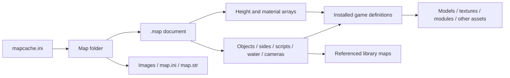

# BFME II map-file specification

**Revision:** 9 October 2026. **Target:** the BFME II 1.06 map family.

This is an implementation-oriented description of the files that make up a map:
their encodings, binary records, relationships and external dependencies. It is
an independently reconstructed specification, not an official EA specification.
It describes all section/version combinations observed in the workshop's local
corpus; unknown meanings and untested variants are explicitly identified.

The principal reference is the serialized data, supported by repository readers,
retail-file comparisons and recorded engine observations. A decoded field is not
automatically a fully understood gameplay feature. Tool limits below are not
claimed engine limits. No new compatibility tests were run for this document.

## Contents

1. [Files and dependencies](#files-and-dependencies)
2. [Primitive encodings](#primitive-encodings)
3. [Compression](#compression)
4. [Document and chunk container](#document-and-chunk-container)
5. [Property dictionaries](#property-dictionaries)
6. [Section directory and versions](#section-directory-and-versions)
7. [Terrain](#terrain)
8. [World settings, objects and waypoints](#world-settings-objects-and-waypoints)
9. [Players, teams, libraries and bases](#players-teams-libraries-and-bases)
10. [Scripts](#scripts)
11. [Triggers and water](#triggers-and-water)
12. [Lighting, environment and cameras](#lighting-environment-and-cameras)
13. [Cross-record constraints](#cross-record-constraints)
14. [Worked binary example](#worked-binary-example)
15. [Implementation and evidence](#implementation-and-evidence)

## Files and dependencies

A `.map` is a binary scene/scenario document, **not a heightmap image or a bundle
of all game assets**. It combines terrain data, object placements, settings,
players, scripts and references to the installed game's definitions and assets.

The workshop's generated map folders use this arrangement:

```text
maps/
  mapcache.ini                   Discovery/cache metadata for the isolated mod
  <map-name>/
    <map-name>.map              Binary map document
    <map-name>_art.tga          Map artwork sidecar
    <map-name>_pic.tga          Map preview sidecar
    map.ini                    Optional map-local game configuration
    map.str                    Optional localized text
```

This is a packaging convention used by the project, not a claim that every
engine entry point requires all these files. A `.map` does not embed its TGA
sidecars or `map.ini`. Renaming a package requires consistent file paths and
cache references; changing the display title alone need not change its filename.

| File/input | Relationship to the map |
| --- | --- |
| `.map` | Geometry, placements, settings, references and embedded scripts |
| `.bse` | Base-template documents in the same container family; may include `CastleTemplates` |
| Library `.map` files | Reusable scripts/teams referenced by `LibraryMapLists`; not necessarily playable standalone maps |
| `mapcache.ini` | Text metadata outside `.map`: virtual path, file size/CRC, display text, extents and starts |
| `map.ini` | Text overrides/definitions interpreted by the game, separate from binary properties |
| `map.str` | Text resources; localization lookup is separate from the binary string encodings below |
| `*_art.tga`, `*_pic.tga` | Image assets beside the map, not terrain elevation arrays |
| `Maps.big`, `Bases.big`, `Libraries.big` | Archives containing documents; BIG is an archive format, not an extra CkMp section |
| Game INI and assets | Object/terrain/road definitions, models, textures, modules, audio and rules referenced by names |
| Authoring PNG/JPEG heightmap | Optional input to a generator; the native map stores converted elevation samples |

Exact stock-menu requirements, cache/checksum equivalence and multiplayer
transfer rules remain unverified. The current cache helper emits CRC32 and an
isolated-mod entry; this does not certify every engine discovery path.



## Primitive encodings

All numbers are **little-endian**, except explicitly identified RefPack header
lengths. Records are packed consecutively: **no implicit alignment or padding**.

| Notation | Encoding |
| --- | --- |
| `u8`, `u16`, `u24`, `u32` | Unsigned integer of 1, 2, 3 or 4 bytes |
| `i32` | Signed 32-bit integer |
| `f32` | IEEE-754 binary32 float |
| `vec2`, `vec3` | Two/three consecutive `f32` values |
| `str` | `u16 byteCount`, then exactly that many CP1252 bytes; no terminator |
| `wstr` | `u16 codeUnitCount`, then that many UTF-16LE code units; no terminator |
| `nameStr` | Unsigned base-128 variable-length byte count, then UTF-8 bytes |
| `nameKey` | `u8 kind`, then `u24 nameID`; the kind's meaning depends on the enclosing record |
| `props` | Property dictionary defined below |
| `T[n]` | Exactly `n` serialized instances of `T` |
| `count + T[]` | A count immediately followed by records; count is `u32` unless stated otherwise |

For a variable-length name length, each byte contributes its low seven bits,
least-significant group first; bit 7 indicates another byte follows. Name-table
strings and ordinary record strings use **different length encodings and
character encodings**. UTF-16 lengths count code units, not Unicode code points.

Boolean-labelled fields retain their stored integer widths and raw values.
They are not all single-byte fields: script operation enable fields are `u32`.

## Compression

The current reader accepts either an uncompressed `CkMp` document or this wrapper:

| Offset | Type | Value |
| ---: | --- | --- |
| 0 | 4 bytes | `45 41 52 00` = `EAR\0` |
| 4 | `u32` | Decompressed byte length |
| 8 | remaining bytes | RefPack stream producing a complete `CkMp` document |

The RefPack stream begins with two flag/signature bytes. The implemented profile
requires `(byte0 & 0x3e) == 0x10` and `byte1 == 0xfb`. Length fields are **big-endian**
and use four bytes when bit `0x80` of byte0 is set, otherwise three. Bit `0x01`
adds an initial length field before the decompressed length; the current reader
skips that initial field. Do not confuse this with the wrapper's little-endian
length at offset 4.

After the RefPack header, read commands until a terminal command. Let `a` be the
first command byte and `b,c,d` additional bytes as shown. First copy `L` literal
bytes from the stream; then copy `N` bytes from output at backward distance `D`.
Backward copies can overlap and repeat previously emitted bytes.

| `a` range | Extra bytes | `L` | `N` | `D` |
| --- | --- | --- | --- | --- |
| `00..7f` | `b` | `a & 3` | `((a & 0x1c) >> 2) + 3` | `((a & 0x60) << 3) + b + 1` |
| `80..bf` | `b,c` | `b >> 6` | `(a & 0x3f) + 4` | `((b & 0x3f) << 8) + c + 1` |
| `c0..df` | `b,c,d` | `a & 3` | `((a & 0x0c) << 6) + d + 5` | `((a & 0x10) << 12) + (b << 8) + c + 1` |
| `e0..fb` | none | `((a & 0x1f) + 1) * 4` | 0 | unused |
| `fc..ff` | none | `a & 3` | 0 | terminal after literals |

Output must equal the RefPack declared length and the outer EAR declared length.
Truncated commands, literals or impossible backward references are invalid.
The toolkit's 128 MiB decompression cap is defensive tool policy.

`Map.encode()` writes uncompressed CkMp. Round-trip evidence therefore compares
**decompressed bytes**, not an identical EAR/RefPack encoding. The general map
reader does not accept a standalone bare RefPack stream as a `.map` container.

## Document and chunk container

```text
Document:
  bytes[4] magic = "CkMp"          # 43 6b 4d 70
  u32 nameCount
  repeat nameCount times:
    nameStr name
    u32 nameID
  Chunk[]                         # until document end, no chunk count

Chunk:
  u32 nameID
  u16 version
  u32 payloadBytes
  bytes[payloadBytes] payload
```

The observed name table stores IDs in descending order `nameCount ... 1`.
The toolkit requires that order and contiguous IDs. Chunk names, property keys,
script operation names and faction keys share this table. An ID is a reference,
not a byte offset or global engine enum.

A chunk header is **10 bytes**. `payloadBytes` excludes the header. A child chunk
uses exactly the same header and shared name table; there is no new local table.
Only specific sections contain child chunks. **Do not recursively parse every
payload as chunks**: terrain planes, counted records and dictionaries have their
own layouts. Children consume their parent's remaining payload, not the file.

No top-level section order is asserted as universally mandatory. Preserve the
observed order when editing; the original-map constructor emits a known working
profile. An unknown chunk can be skipped by length and retained byte-for-byte,
but its name-table references and possible spatial references remain significant.

## Property dictionaries

```text
props:
  u16 propertyCount
  repeat propertyCount times:
    u8 type
    u24 nameID
    value(type)
```

| Type | Stored value | Interpretation |
| ---: | --- | --- |
| 0 | `u8` | Boolean-labelled value; retain raw byte |
| 1 | `i32` | Integer |
| 2 | `f32` | Float |
| 3 | `str` | Narrow string |
| 4 | `wstr` | Wide string |
| 5 | `str` | Narrow string; retain distinct type tag |

There is no individual property payload length. Unknown type tags cannot be
safely skipped without their type definition. Preserve dictionary ordering and
all tags when editing; property meanings depend on the owning section and game
consumer. A known dictionary layout is not a closed catalogue of valid keys.

## Section directory and versions

The corpus has **23 top-level names / 43 name-version combinations** in **270
documents**. The versions below are observed, not a whitelist of every legal
version. Some implementation branches additionally have source/synthetic coverage.

| Section | Observed versions | Payload family |
| --- | --- | --- |
| `HeightMapData` | 5 | Terrain dimensions and elevations |
| `BlendTileData` | 8, 9, 11, 14, 15, 16, 17, 18 | Material/index/flag planes and descriptor tables |
| `WorldInfo` | 1 | `props` |
| `ObjectsList` | 3 | `Object` child chunks |
| `MPPositionList` | 0 | `MPPositionInfo` child chunks |
| `SidesList` | 5, 6 | Sides and embedded build lists |
| `Teams` | 1 | Counted `props` |
| `BuildLists` | 1 | Counted faction build lists |
| `CastleTemplates` | 1–5 | Base-template buildings and paths |
| `LibraryMapLists` | 1 | `LibraryMaps` child chunks |
| `PlayerScriptsList` | 1, 5, 6 | `ScriptList` child chunks |
| `WaypointsList` | 1 | ID-to-ID links |
| `TriggerAreas` | 1 | Named polygons |
| `PolygonTriggers` | 4, 5 | Legacy trigger/water polygons |
| `StandingWaterAreas` | 2 | Water polygons |
| `RiverAreas` | 1, 2 | River cross-sections |
| `StandingWaveAreas` | 1, 2 | Shore-wave geometry/parameters |
| `GlobalLighting` | 7, 8 | Four lighting configurations and extension fields |
| `PostEffectsChunk` | 1 | Counted effect records, **u8 count** |
| `EnvironmentData` | 2, 3 | Water-alpha/macro/cloud settings |
| `NamedCameras` | 2 | Camera bookmarks |
| `CameraAnimationList` | 1, 3 | Animation tracks |
| `SkyboxSettings` | 1 | Skybox transform and scheme |

Typical modern generated skirmish documents contain all of these except
`CastleTemplates`, `PolygonTriggers` and `SkyboxSettings`; many counted lists
are empty. This describes the constructor profile, **not a proven minimal
mandatory-section set**. Context matters for base/library documents.

## Terrain

### HeightMapData v5

```text
u32 W                              # samples including border
u32 H                              # samples including border
u32 B                              # border width in samples
u32 borderRecordCount
u32[2] borderRecords[borderRecordCount]
u32 A                              # must equal W * H
u16 elevations[H][W]               # row-major, X changes fastest
```

The payload length is `20 + 8*borderRecordCount + 2*W*H`. The modern constructor
emits one border record `(W-2B, H-2B)`. Preserve multiple records when reading;
their broader runtime interpretation is not established here.

```text
world Z = elevationSample * 0.0390625
sample X = world X / 10 + B
sample Y = world Y / 10 + B
playable dimensions = (W - 2B, H - 2B) samples
reported world extent = ((W - 2B)*10, (H - 2B)*10)
```

Elevation storage spans `0 .. 2559.9609375` world units. World positions do not
include the border offset. Row-major storage does not imply screen-image Y
orientation; diagnostic images flip rows when presenting a top-down view.
Dimension guards in the parser/writer are tool policy, not proven engine maxima.

### BlendTileData v18 planes

Read `u32 A`, matching the heightmap area, then these planes in order:

| Plane | Stored size | Role |
| --- | --- | --- |
| `tiles` | `u16[A]` | Primary terrain subtile IDs |
| `blends` | `u32[A]` | Blend table indices |
| `three_way` | `u32[A]` | Additional blend indices |
| `cliffs` | `u32[A]` | Cliff-mapping indices |
| `impassable` | packed bits | General blocked plane |
| `impassable_players` | packed bits | Source-labelled player plane; scripted orders differ from assumed semantics |
| `passage_widths` | packed bits | Source-labelled plane; full meaning unresolved |
| `taintable` | packed bits | Source-labelled plane |
| `extra_passable` | packed bits | Does not override `impassable` in recorded tests |
| `flammability` | `u8[A]` | Byte plane; full value semantics unresolved |
| `visible` | packed bits | Source-labelled plane |

Each packed plane occupies `H * ceil(W/8)` bytes. Each row is padded separately;
the low bit represents the first X sample in that byte. Never pack all `W*H`
bits as one uninterrupted bitstream unless row widths are byte-aligned.

For legacy versions, the four index planes remain in the same order, but
blend/three-way/cliff indices are `u16` before v14 and `u32` from v14. Optional
planes are introduced at versions: impassable 8, players 10, passage 11,
taintable 14, extra-passable 15, flammability 16, visible 17. This describes the
implemented v8–18 layout family; v10/12/13 are not observed in the audited corpus.
Legacy decoding does not imply support for editing those versions.

### BlendTileData descriptor tail

Immediately after the final plane:

```text
u32 textureCellCount
u32 declaredBlendCount
u32 declaredCliffCount
u32 textureClassCount
repeat textureClassCount:
  u32 firstCell
  u32 cellCount
  u32 cellSize
  u32 reserved                    # observed/required zero in current parser
  str textureName
u32 edgeCellCount
u32 edgeClassCount
repeat edgeClassCount:
  u32 firstCell
  u32 cellCount
  u32 cellSize
  str textureName
BlendRecord[max(declaredBlendCount-1, 0)]
CliffRecord[max(declaredCliffCount-1, 0)]
```

Ordinary texture descriptors satisfy `cellCount == cellSize²` in the supported
profile. Each bitmap cell has four subtiles. Plane IDs address subtiles across
the sequential descriptor palette; descriptor `firstCell` is not an arbitrary
filename index. The current mapping uses a cumulative `4*cellCount` subtile span
per texture. Within a repeating class of size `S`, phase is:

```text
4 * (((y // 2) % S) * S + (x // 2) % S) + (y % 2)*2 + x % 2
```

Blend/cliff index zero means no record. Declared counts normally include this
implicit zero slot; stored records begin at index 1. A zero declared cliff count
also occurs and is treated as an empty table. Edge-table nonempty layouts have
synthetic/source coverage, not a confirmed nonempty retail example here.

`BlendRecord` is **18 bytes**:

| Offset | Type | Field |
| ---: | --- | --- |
| 0 | `u32` | Secondary subtile ID |
| 4 | 4 bytes | Horizontal, vertical, right-diagonal, left-diagonal switches |
| 8 | `u8` | Flags: source bit 0 invert, bit 1 force flip; retain other bits |
| 9 | `u8` | Long-diagonal/two-sided raw value |
| 10 | `i32` | Custom edge-class index; `-1` = none |
| 14 | `u32` | Observed marker `0x7ada0000` |

`CliffRecord` is **38 bytes**: `u32 subtile`, four `vec2` UV coordinates, `u8 flip`,
`u8 mutant`. Source corner order is `(x,y), (x+1,y), (x+1,y+1), (x,y+1)`.
These are texture mappings, not gameplay cliff objects or automatic barriers.

**Preserved exception:** Rhûn has 711 out-of-palette primary IDs, all outside
the playable rectangle. Inspection retains/reports them; authoring guards reject
them. Their intended meaning is unresolved. Do not silently clamp retail data.

## World settings, objects and waypoints

### WorldInfo v1

Payload: one `props` dictionary. Used keys include `mapName`, `mapDescription`,
`cameraMaxHeight`, pitch/yaw, camera-ground fields, weather and scenario flags.
These are typed properties, not a fixed struct. Missing keys can rely on game
defaults. Do not infer terrain elevation from camera-ground settings or assume
the `compression` property overrides the actual outer file signature.

### ObjectsList v3 / Object v3

`ObjectsList` contains consecutive `Object` child chunks, **without a count**.
Each modern `Object` payload is:

| Offset | Type | Field |
| ---: | --- | --- |
| 0 | `vec3` | World X/Y and terrain-relative Z offset |
| 12 | `f32` | Orientation in radians |
| 16 | `u32` | Object/road flags |
| 20 | `str` | Object or road template name |
| variable | `props` | Placement properties |

Object definitions, models, footprint, collision and behavior are external game
data. Common properties include `uniqueID`, `objectName`, `originalOwner`,
`objectLayer`, health and enabled state. These names are not interchangeable:
`objectName` is used by named script references; `uniqueID` is placement identity;
`originalOwner` commonly combines a player and team path.

Road segments use adjacent start/end objects with flags `0x02` and `0x04`, same
template name. Modifier bits `0x08/0x40/0x80` have source-derived corner/join
interpretations; native modifier rendering remains incomplete. Preserve all
other bits. A `GondorIthilienBridge2` is instead one ordinary walk-on-wall object.
See [road/bridge evidence](../navigation/roads-and-bridges.md) before conflating
these with the source-family `0x10/0x20` paired bridge format.

### Waypoints

Waypoint **positions** are `Object v3` records with template
`*Waypoints/Waypoint` and properties such as `waypointID`, `waypointName` and
`waypointTypeOption`. Skirmish starts conventionally use `Player_1_Start` etc.

`WaypointsList v1` stores **links**, not waypoint positions:

```text
u32 linkCount
repeat linkCount: i32 startID, i32 endID
```

IDs refer to waypoint object properties. Reordering objects is different from
renumbering waypoint IDs. Script references may use waypoint names instead.

## Players, teams, libraries and bases

### MPPositionList v0

Consecutive `MPPositionInfo` chunks, no leading count:

```text
MPPositionInfo v0: u8 human, u8 computer, u32 team
MPPositionInfo v1: u8 human, u8 computer, u8 loadAI, u32 team,
                  u32 restrictionCount, str sideRestrictions[restrictionCount]
```

The constructor emits eight multiplayer slots even for a two-start map. Slot
count, number of starts, side count and active players are different quantities.

### SidesList v5/v6 and Teams v1

```text
SidesList:
  if version >= 6: u8 leadingBooleanRaw
  u32 sideCount
  repeat sideCount:
    props side
    u32 buildEntryCount
    BuildEntry entries[buildEntryCount]

Teams:
  u32 teamCount
  props teams[teamCount]
```

The leading side byte's purpose remains unresolved. Side properties include
player name, faction, display name, human flag, allies and enemies. Teams use
names and owners, not object-list indices. Neutral/supporting sides occur beside
playable sides. The matched retail side reader supports at most 20 sides;
that is a side-reader constraint, not 20 playable multiplayer slots.

### BuildLists v1 and BuildEntry

```text
u32 factionCount
repeat factionCount:
  nameKey faction
  u32 entryCount
  BuildEntry entries[entryCount]

BuildEntry:
  str buildingName
  str template
  vec3 position
  f32 angle
  u8 initiallyBuilt
  u32 rebuilds
  str script
  i32 health
  u8 whinerRaw, u8 unsellable, u8 repairable
```

This is the BFME **map** build-list record, not the larger savegame struct or
another SAGE game's same-numbered section. The matched embedded-side reader
consumes XYZ but uses runtime Z=0; the standalone faction-list reader retains Z.
Source interprets `0xffffffff` rebuilds as unlimited. Wider execution behavior
and `whinerRaw` remain unresolved.

### LibraryMapLists v1 / LibraryMaps v1

Outer payload is a sequence of `LibraryMaps` child chunks. Each child contains
`u32 mapCount`, then `str mapNames[mapCount]`. Keep list slots aligned with the
side/script contexts. Library linking merges scripts/teams; a name string does
not itself contain the referenced library's records. See [base/library semantics](../players-economy-and-ai/bases.md).

### CastleTemplates v1–5

```text
nameKey faction
u32 buildingCount
repeat buildingCount:
  str buildingName, str template
  vec3 relativePosition
  f32 angle
  if version >= 4: i32 priority, i32 phase
if version >= 2:
  u32 pathCount
  repeat pathCount:
    if version >= 5: str pathName
    u32 pointCount
    if version == 2: i32[3] points[pointCount]
    if version >= 3: vec2 points[pointCount]
```

Coordinates are relative to the base center. The matched retail chunk reader
discards stored priority/phase, path names and old points' third integer; preserve
them for other consumers. Writing this chunk alone does not create a working AI
base. Original objects, selection properties, definitions and AI rules also matter.

## Scripts

`PlayerScriptsList` v1/5/6 contains `ScriptList v1` chunks; there is no leading
count. The modern hierarchy is:

```text
PlayerScriptsList
  ScriptList
    ScriptGroup                    # optional; prefix followed by children
      Script / ScriptGroup
    Script
      OrCondition
        Condition
      ScriptAction                 # true branch
      ScriptActionFalse            # false branch
```

All nodes have normal chunk headers. Prefix fields below are followed by child
chunks until the node's payload boundary; **there is no child count**.

| Node/version | Prefix |
| --- | --- |
| `ScriptList v1` | None |
| `ScriptGroup v1–3` | `str name, u8 active, u8 subroutine`; nested groups only supported from v3 |
| `Script v1` | Four strings: name, comment, conditions comment, actions comment; six bytes: active, deactivate-on-success, easy, medium, hard, subroutine |
| Script v2 addition | `u32 evaluationIntervalRaw` |
| Script v3 addition | `u8 sequential, u8 loop, i32 loopCount, u8 targetTypeRaw, str targetName` |
| Script v4 addition | `str playerMaskText` |
| `OrCondition v1` | None; contains conditions |

Conditions inside one `OrCondition` form an AND group; groups are OR alternatives
in the native lab. More complex sequential/group/difficulty behavior remains
partially understood. Preserve evaluation and target fields instead of assuming
their values or treating them as editor-only comments.

Operation payload:

```text
u32 opcodeRaw
nameKey internalName
u32 argumentCount
Argument arguments[argumentCount]
if Condition version >= 5: u32 enabledRaw, u32 conditionFlag4dRaw
if ScriptAction/ScriptActionFalse version >= 3: u32 enabledRaw

Argument:
  u32 typeID
  if typeID == 16: vec3 position
  otherwise: i32 integerValue, f32 floatValue, str stringValue
```

Supported operation versions are Condition v4/5/6 and both action branches v2/3.
For a non-position argument, the integer, float and string are **all stored**;
they are not a union. Do not drop apparently unused fields. Type 16 positions
must be considered when moving/resizing geometry.

`conditionFlag4dRaw` is **not established as condition inversion**; an original
native test disproved that shortcut. Numeric opcodes can move between versions:
retain the internal name and argument types. The bundled BFME2 1.06 catalogue
has 595 named action / 195 named condition signatures, not verified behavior for
every operation. Legacy argument migrations are separate from layout decoding.

See the [script reference](../scripts/README.md) for argument types, version
comparisons, writer constraints and native observations.

## Triggers and water

Each section below starts with `u32 recordCount`. Record layouts follow.

### TriggerAreas v1

```text
str name, str layer, u32 id
u32 pointCount, vec2 points[pointCount]
u32 unknownRaw
```

Names can be referenced by scripts. Polygon semantics, winding constraints and
the trailing integer are not fully specified by reading this layout alone.

### StandingWaterAreas v2

```text
u32 id, str name, str layer, f32 uvSpeed, u8 additive
str bumpTexture, str skyTexture
u32 pointCount, vec2 points[pointCount]
u32 waterHeight
str shader, str depthColors
```

Water height is a stored integer world elevation, not an elevation sample in
HeightMapData's fixed-point scale. Polygon positions use world XY. Material
references affect rendering; native depth/pathability is a separate question.

### RiverAreas v1/v2

Both inspected versions use this record layout:

```text
u32 id, str name, str layer, f32 uvSpeed, u8 additive
str texture, str noise, str alphaEdge, str sparkle
u8 colorBytes[4]
f32 alpha, u32 waterHeight, str minLOD
u32 crossSectionCount
f32[4] crossSections[crossSectionCount]   # two XY endpoints per section
```

These are cross-sections, not one ordinary polygon vertex array. Preserve endpoint
and section order. The exact color-channel/LOD interpretation is not established
by the raw field names alone.

### StandingWaveAreas v1/v2

```text
u32 id, str name, str layer, f32 uvSpeed, u8 additive
u32 pointCount, vec2 points[pointCount]
u32 unknownRaw
u32 waveParameters[9]
str texture
if version >= 2: u32 enablePCARaw
```

Source-derived parameter order: final width, final height, initial width fraction,
initial height fraction, initial velocity, time to fade, time to compress,
second-wave time offset, distance from shore. They are stored as nine **u32**
values; units/ranges and all runtime effects remain unverified. Shore waves are
separate geometry from water surfaces and navigation.

### PolygonTriggers v4/v5

Legacy combined trigger/water record:

```text
str name, str layer, u32 id
u8 isWaterRaw, u8 isRiverRaw, u32 riverStart
if version >= 5:
  str riverTexture, str noiseTexture, str alphaEdge, str sparkle,
      str bumpTexture, str skyTexture
  u8 additiveRaw, u8 riverRGB[3], u8 unknownByte
  f32 uvSpeed[2], f32 riverAlpha
u32 pointCount, i32[3] points[pointCount]
```

These legacy points are signed integer triplets, not the modern `vec2` floats.
Nonempty old polygon behavior needs further native evidence. Do not convert
between old and modern water/trigger sections by only renaming the chunk.

## Lighting, environment and cameras

### GlobalLighting v1–8

The corpus observes v7/v8; earlier branches have matched-source/synthetic support.
Begin with `u32 timeOfDay`. Then write **four configurations**, each containing
the light slots supported by that version, in this order:

| Added in version | Slots appended to each configuration |
| ---: | --- |
| 1 | Terrain light 0, object light 0 |
| 2 | Object lights 1 and 2 |
| 3 | Terrain lights 1 and 2 |
| 4 | Third-array lights 0, 1 and 2 |

Each light is `vec3 ambientRGB, vec3 diffuseRGB, vec3 directionXYZ` (**36 bytes**).
After all four configurations:

```text
if version >= 5: f32 overbrightValue
if version >= 6: u32 chunkFlagRaw, vec3 triplet0
if version >= 7: vec3 triplet1, vec3 triplet2
u32 shadowColorRaw                  # optional at end of older versions
if version >= 8: f32 finalValues[3] # requires preceding shadow color here
```

Modern v8 payload: **1,360 bytes**; v7 with shadow: **1,348 bytes**. The word
immediately following the light arrays is **overbright float**, not shadow color.
The third array, triplets, flag and final-value meanings remain partly unknown;
do not invent descriptive target names. Full slot/tail readback is documented in
[lighting evidence](../terrain-and-presentation/lighting.md).

### Environment and post effects

```text
EnvironmentData v2/v3:
  if version >= 3: f32 waterMaxAlphaDepth, f32 deepWaterAlpha
  u8 macroTextureStretched, str macroTexture, str cloudTexture

PostEffectsChunk v1:
  u8 effectCount
  repeat effectCount: str name, f32 blendFactor, str lookupImage

SkyboxSettings v1:
  vec3 position, f32 scale, f32 rotation, str textureScheme
```

An empty PostEffectsChunk is **one zero byte**, unlike the four-byte zero counts
in most list sections. Do not confuse visual water-alpha settings with logical
water depth or movement permission.

### NamedCameras v2

```text
u32 cameraCount
repeat cameraCount:
  vec3 lookAt
  str name
  f32 pitch, f32 roll, f32 yaw, f32 zoom, f32 fieldOfView, f32 unknownRaw
```

Field names are current source/reader interpretations. Exact angle/focal units
for all camera fields have not been independently established; the object-angle
radian rule must not be blindly applied to every camera field.

### CameraAnimationList v1/v3

Both versions use the inspected track layout:

```text
u32 animationCount
repeat animationCount:
  bytes[4] typeCode
  str name, u32 numFrames, u32 startOffset
  CameraTrack
  if typeCode decodes to "look": TargetTrack

Track:
  u32 keyCount
  repeat keyCount:
    u32 frameIndex
    bytes[4] interpolationCode
    vec3 positionOrTarget
    if free camera: f32 rotationRaw[4]
    if look camera: f32 roll
    if camera (not target): f32 focalParameterRaw
```

Stored FourCC bytes are reversed relative to human labels: `eerf` → `free`,
`kool` → `look`, `mtac` → `catm`, `enil` → `line`. These identify the decoded
track shapes. Interpolation timing, rotation interpretation and focal semantics
remain incomplete. Target keys do not contain the extra rotation/focal fields.

## Cross-record constraints

For a reader/writer conforming to this documented profile:

1. Bound every count, length and child to its containing buffer. Consume the
   entire known payload; do not silently accept leftover bytes as padding.
2. Resolve name IDs through the document table. Preserve existing IDs when any
   opaque data survives; newly added names can receive new IDs.
3. Keep height/material dimensions consistent. Preserve row padding, index
   widths and table zero-slot rules for the actual chunk version.
4. Validate interpreted table references while retaining/reporting documented
   exceptions in inspection mode. Do not normalize unexplained retail values.
5. Keep object, team, player, waypoint, trigger, library and script references
   consistent. These use different IDs/names and are not interchangeable.
6. Spatial edits must address terrain, objects, starts, water, triggers, links,
   camera tracks/bookmarks, base data and position-valued script arguments as
   applicable. Preserve unknown spatial records or refuse that transformation.
7. Preserve unknown flags, raw fields and opaque chunks. A numeric enum from
   another SAGE game is insufficient evidence to reinterpret a BFME2 value.
8. Refresh external cache/sidecar/package metadata after changes. File byte
   length and compressed-file hash differ from decompressed document identity.

These rules establish structural consistency. They do not establish gameplay
balance, asset availability, route clearance, AI behavior, multiplayer sync or
save/load correctness. Engine rules live partly outside the map file.

## Worked binary example

This **56-byte synthetic document** contains only `WorldInfo.mapName = "Demo"`.
It illustrates parsing and name references; it is **not a playable map** because
terrain, sides and other scenario sections are absent.

```text
Offset  Hex bytes                                 Meaning
0000    43 6b 4d 70                               CkMp
0004    02 00 00 00                               two names
0008    09 57 6f 72 6c 64 49 6e 66 6f            UTF-8 "WorldInfo", length 9
0012    02 00 00 00                               name ID 2
0016    07 6d 61 70 4e 61 6d 65                  UTF-8 "mapName", length 7
001e    01 00 00 00                               name ID 1
0022    02 00 00 00 01 00 0c 00 00 00            WorldInfo chunk: ID 2, v1, 12 bytes
002c    01 00                                     one property
002e    03 01 00 00                               type 3, name ID 1
0032    04 00 44 65 6d 6f                         CP1252 "Demo", length 4
```

Offsets are hexadecimal. The chunk begins at decimal 34; payload at 44; document
ends at 56. The shared table supplies both the chunk name and property key.
The example was constructed and byte-round-tripped with the current container
reader; no game launch is implied.

## Implementation and evidence

| Subject | Implementation / detailed evidence |
| --- | --- |
| EAR and RefPack | [map_archive.py](../../../src/bfmexbar/formats/map_archive.py) |
| Container, properties, heights, planes, objects | [map.py](../../../src/bfmexbar/formats/map.py) |
| Blend/cliff/edge tables | [terrain.py](../../../src/bfmexbar/formats/terrain.py), [terrain evidence](../terrain-and-presentation/terrain.md) |
| Section records and nested lists | [analyze.py](../../../src/bfmexbar/mapkit/analyze.py) |
| Scripts and operand layouts | [scripts.py](../../../src/bfmexbar/formats/scripts.py), [script reference](../scripts/README.md) |
| Lighting | [lighting.py](../../../src/bfmexbar/formats/lighting.py) |
| Bases | [castles.py](../../../src/bfmexbar/formats/castles.py), [base/library evidence](../players-economy-and-ai/bases.md) |
| Cache convention | [cache.py](../../../src/bfmexbar/mapkit/cache.py) |
| Observed corpus and constraints | [Coverage reference](reference.md), [measured file offsets](format.md) |
| Source attribution | [Third-party notices](../../licenses/THIRD_PARTY.md): OpenSAGE, EA source and OpenBFME2 |

The local corpus comprises 67 maps from Maps.big, 152 base documents and 51 library
maps. The source/behavior references record which claims are corpus observations,
source-derived interpretations, synthetic fixtures or native tests. Unresolved
semantics remain unresolved even where the byte layout is fully consumed.

Inspection, from an installed checkout:

```powershell
python -m bfmexbar.mapkit.analyze 'path/to/map.map' --out artifacts/map-analysis.json
python -m bfmexbar.mapkit.coverage 'path/to/Maps.big' --out artifacts/map-coverage.json
```

The analyzer is read-only. Its JSON exposes chunk versions/sizes/offsets,
decoded records, unresolved sections and exact decompressed round-trip status.
Reports and licensed input files stay local; the repository distributes the
specification, independent tooling and original test fixtures.
