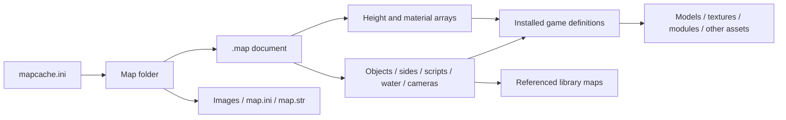

# Files and dependencies

[Specification index](../specification.md) · [Next](binary-container.md)

A `.map` is a binary scene/scenario document, **not a heightmap image or a bundle
of all game assets**. It combines terrain data, object placements, settings,
players, scripts and references to the installed game's definitions and assets.

The workshop's generated map folders use this arrangement:

```text
maps/
  mapcache.ini                   Discovery/cache metadata for the isolated mod
  <map-name>/
    <map-name>.map              Binary map document
    <map-name>_art.tga          Map artwork sidecar
    <map-name>_pic.tga          Map preview sidecar
    map.ini                    Optional map-local game configuration
    map.str                    Optional localized text
```

This is a packaging convention used by the project, not a claim that every
engine entry point requires all these files. A `.map` does not embed its TGA
sidecars or `map.ini`. Renaming a package requires consistent file paths and
cache references; changing the display title alone need not change its filename.

| File/input | Relationship to the map |
| --- | --- |
| `.map` | Geometry, placements, settings, references and embedded scripts |
| `.bse` | Base-template documents in the same container family; may include `CastleTemplates` |
| Library `.map` files | Reusable scripts/teams referenced by `LibraryMapLists`; not necessarily playable standalone maps |
| `mapcache.ini` | Text metadata outside `.map`: virtual path, file size/CRC, display text, extents and starts |
| `map.ini` | Text overrides/definitions interpreted by the game, separate from binary properties |
| `map.str` | Text resources; localization lookup is separate from the binary string encodings below |
| `*_art.tga`, `*_pic.tga` | Image assets beside the map, not terrain elevation arrays |
| `Maps.big`, `Bases.big`, `Libraries.big` | Archives containing documents; BIG is an archive format, not an extra CkMp section |
| Game INI and assets | Object/terrain/road definitions, models, textures, modules, audio and rules referenced by names |
| Authoring PNG/JPEG heightmap | Optional input to a generator; the native map stores converted elevation samples |

Exact stock-menu requirements, cache/checksum equivalence and multiplayer
transfer rules remain unverified. The current cache helper emits CRC32 and an
isolated-mod entry; this does not certify every engine discovery path.


